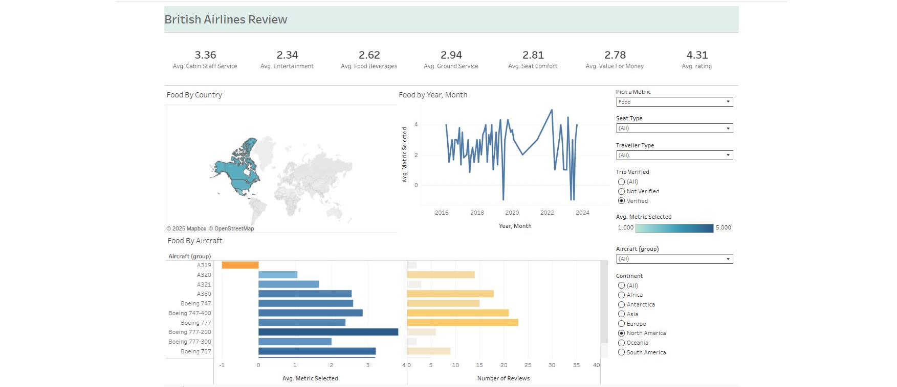
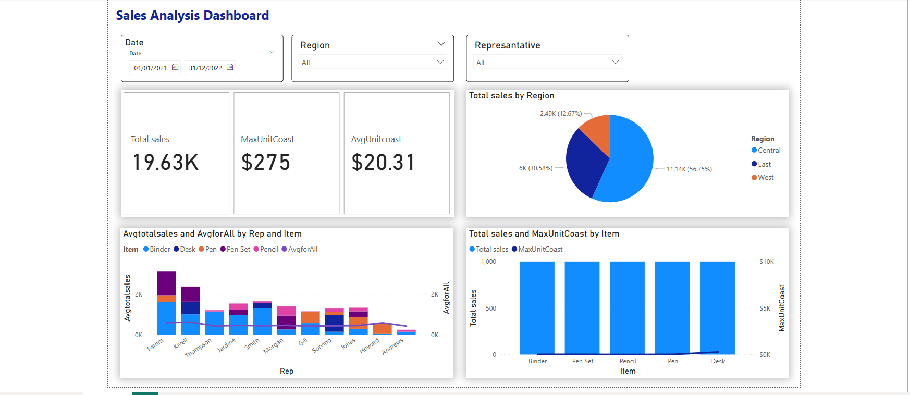
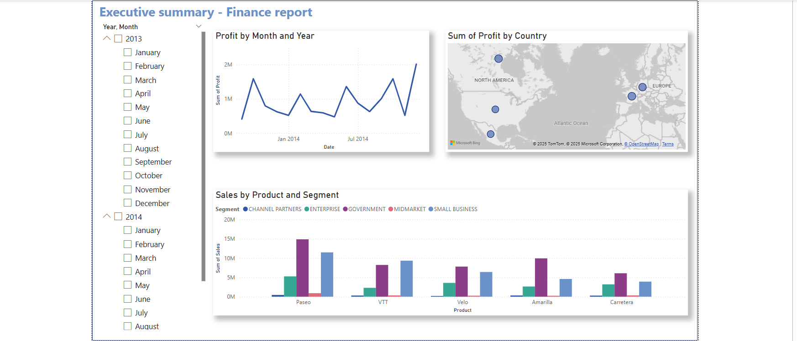

# Movie Data Analysis Dashboard

## Overview

An interactive dashboard project analyzing movie data from 2012 to 2016 to uncover industry trends and insights. This analysis aims to identify patterns in movie performance, helping stakeholders make data-driven decisions.

## Table of Contents

- [Introduction](#introduction)
- [Data Source](#data-source)
- [Technologies Used](#technologies-used)
- [Data Preparation](#data-preparation)
- [Analysis and Visualizations](#analysis-and-visualizations)
- [Findings](#findings)

### Introduction

The "Movie Data Analysis Dashboard" project focuses on exploring various aspects of movie data to understand the dynamics of the film industry between 2012 and 2016.

### Data Source

- **Movie Data**: The datesate I used for this analysis is [Movie Dataset](https://www.kaggle.com/code/hakankeskin/movie-data-analysis-2012-2016)
- This dataset contains information on Hollywood movies released between 2012 and 2016, including titles, release dates, genres, directors, cast, production budgets, and box office revenues. Analyzing this data can reveal trends in the film industry over those years, such as popular genres, effective production strategies, the influence of directors and actors on box office success, and the relationship between budget and revenue.
### Technologies Used

- **Power Query**: For data cleaning and transformation.
- **Microsoft Excel**: Utilizing pivot tables for analysis and creating reports.
- **M Language**: Implemented for advanced data manipulation in Power Query.

### Data Preparation

- Loaded and inspected the dataset for consistency.
- Handled errors and missing values to ensure data integrity.
- Cleaned and formatted data using Power Query for efficient analysis.The exel file after the data cleaning & with a dashboards can be found here - [dashboard_movies.xlsx](https://github.com/user-attachments/files/17670647/dashboard_movies.xlsx)


### Analysis and Visualizations

- Performed exploratory data analysis using pivot tables.
- Created interactive charts and graphs to visualize trends.
- Utilized M Language for grouping and combining genres.

### Findings

- **Top Genres**: Identified the most profitable genres during the specified period.
- **Key Players**: Analyzed directors and actors who consistently delivered high-grossing movies.
- **Budget vs. Revenue**: Explored the relationship between production budgets and box office returns.

### Data Visualization
There are three filters on the dashboard that filter our data. There are two charts visualizing top 10 genres by boxx office and release date with boxx oficce values 


#### M Language 

One of interesting features I was working with was a specific code for Grouping in M language which enable me to Combine genres together for further analysis.

```

= Table.Group(#"Sorted Rows1", {"Movie Title"}, 

                                            {{"Combined Genre", each Text.Combine([Concat Genre], " / "), type text},

                                            {"AllData", each _, 

                                                        type table [Movie Title=nullable text, Release Date=nullable date, Wikipedia URL=nullable text, Concat Genre=nullable text, Director=nullable text, Actor First=nullable text, Actor Second=nullable text, Actor Third=nullable text, Actor Fourth=nullable text, Actor Fifth=nullable text, #"Budget ($)"=nullable number, #"Box Office Revenue ($)"=nullable number]}

                                            }

```
## ✈️ British Airlines Reviews Dashboard

This interactive Tableau dashboard analyzes over 1,500 British Airways passenger reviews across key service categories.

📊 View online:  
👉 [British Airlines Dashboard on Tableau Public](https://public.tableau.com/views/BritishAirlinesReviewsDashboard_17503696334530/Dashboard)



### Features:
- KPI metrics on staff, food, entertainment, comfort, and more
- Interactive map by country and timeline of reviews
- Aircraft-type analysis with filterable dimensions

```
📊 Power BI Sales Dashboards

### 📌 1. Sales Analysis Dashboard  
High-level overview of sales performance.

- Total Sales, Max Unit Cost, Avg Unit Cost  
- Breakdown by Region & Item  
- Date/Region/Rep filters  

📂 [Download PBIX](sale analysis dashboard.pbix)  


---

### 📌 2. Sales Report Dashboard  
Item-level and regional performance.

- Total Sales and Max Unit Cost by Item  
- Regional distribution pie chart  
- Representative & region slicers  

📂 [Download PBIX](sales report.pbix)  
 

> 📝 *Datasets are anonymized and used for demonstration purposes only.*
